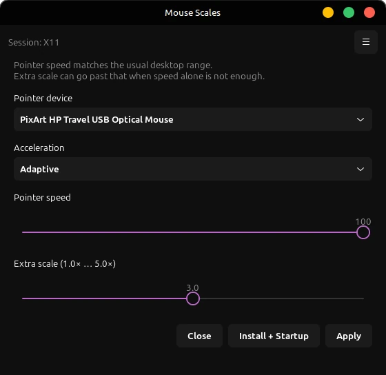

# Mouse Scales

Can set pointer speed and extra scale past the desktop slider on Linux.



Mouse Scales is a GTK4 tool for when the usual desktop pointer slider is not enough. On X11 it can set libinput Accel Speed, Adaptive or Constant profile, and an extra movement scale through the Coordinate Transformation Matrix. On Wayland it can set reported DPI via udev, with optional Hyprland and Sway extras. Settings can be saved for login.

## Build

Needs Meson, Ninja, Vala, GTK 4, and pkg-config.

```sh
git clone git@github.com:Obsidian-Jackal/MouseScales.git
cd MouseScales
meson setup build
meson compile -C build
```

Run without installing:

```sh
./build/src/mouse-scales
```

Install:

```sh
meson install -C build
```

X11 sessions need `xinput`.

## Packaging

- Debian: `debian/`
- Arch: `packaging/arch/PKGBUILD`
- Fedora: `packaging/fedora/mouse-scales.spec`

## License

BSD 3-Clause. See [`LICENSE`](LICENSE).
